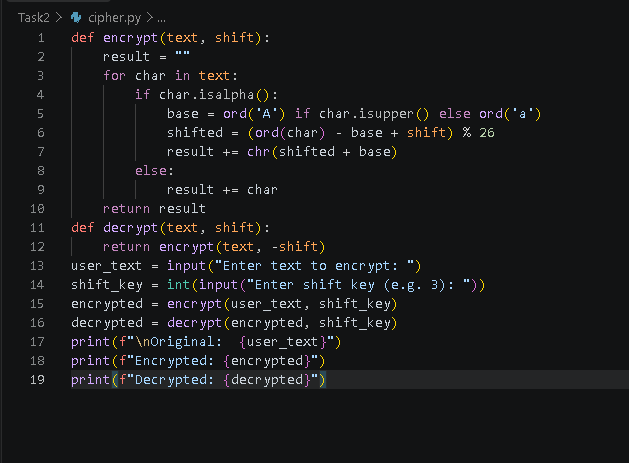
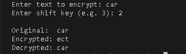

# Task 2: Basic Encryption & Decryption (Caesar Cipher)

A Python program that encrypts and decrypts user text using a Caesar cipher — a substitution technique where each letter is shifted by a fixed key.

## What it does
- Takes user input text and a shift key
- Encrypts the text by shifting each letter forward by the key
- Decrypts the encrypted text back to the original using the reverse shift
- Displays the original, encrypted, and decrypted output

## How it works
- Each letter is converted to a 0–25 range based on its position in the alphabet
- The shift key is added (encryption) or subtracted (decryption) to move the letter
- Non-alphabet characters (spaces, numbers, punctuation) are left unchanged
- The `% 26` operation wraps the shift around the alphabet (so shifting past 'Z' loops back to 'A')

## Code


## Example Output


## Why this project
Caesar ciphers aren't used in real-world security today, but building one helps reinforce core encryption logic — and highlights exactly why modern encryption methods (like AES) exist to fix the weaknesses of a simple substitution cipher (e.g. it's trivially breakable with frequency analysis or brute force, since there are only 25 possible shifts).

## How to run
```bash
python cipher.py
```